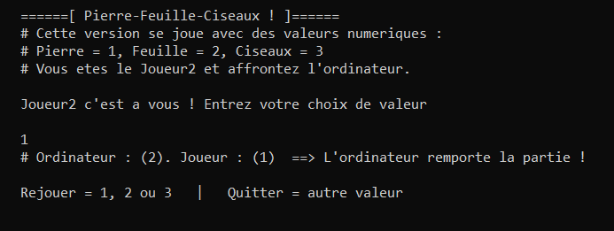

A rock-paper-scissors console game written in assembly x86 with SASM.

You choose a value (1, 2, or 3) and play against the computer.
The computer choice is generated with a time stamp counter (TSC, # of CPU clock cycles since reset).

